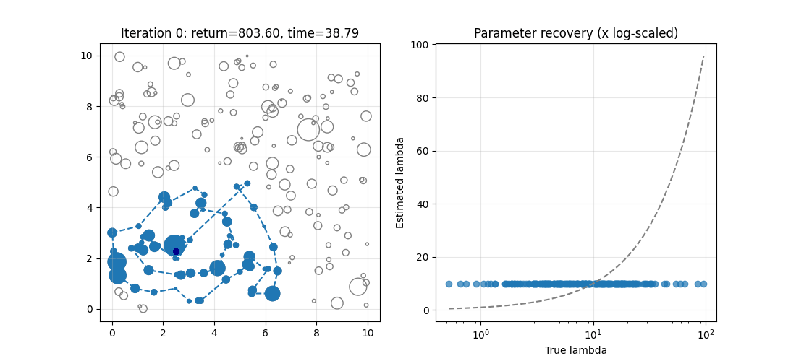

# Stochastic Orienteering

---

200 nodes with size proportional to their mean reward. Time window of the route is 40.

Left: the spots and the greedy route using the posterior means as rewards. 
The reported return is the expected return of that route under the true lambdas.
Interestingly the first route already achieves high return. 
Probably because all posteriors are identical initially, so the solver just maximizes spots visited, 
which turns out to be a good strategy when lambdas are relatively homogeneous.

Right: scatter plot of true lambdas vs posterior means. Points on the dashed line mean perfect recovery.

## Problem

A pickpocket wants to set up a daily route through the city to rob as many people as possible. 
At each spot the number of people they can rob is drawn from some unknown distribution, independent across spots.

Each day they pick a route within a time budget. 
Getting between spots takes time, robbing someone doesn't. 
The goal is to find the optimal route in as few days as possible.

If we already knew the expected value (EV) of each spot this would just be the classical **Orienteering Problem**: 
find the path through a weighted graph that maximizes total reward within a time budget (already NP-hard).

What makes it more interesting is that we don't know the EVs. 
So we also have to figure out which spots are worth revisiting versus exploring new ones, 
the classic **exploration-exploitation tradeoff**. 
This puts it in the family of **combinatorial multi-armed bandits** where the actions are all feasible routes. 

## Approach

Spot rewards are modeled as Poisson distributed with a Gamma prior on each spot's lambda. 
Gamma is the conjugate prior for Poisson so updates are easy. 
Each day we use **Thompson Sampling**: sample a lambda from each spot's posterior, 
solve the orienteering problem on those samples, execute the route, observe spot rewards, then update posteriors for 
visited spots. 
Estimates converge over time and the route stabilizes.

The orienteering solver is a greedy ratio heuristic: at each step pick the unvisited spot with the 
highest `reward / detour_cost` that still allows returning to start within the time budget.

## Outlook

There is still a lot to be improved and explored. For example using simulated annealing in the greedy solver 
or trying this approach on other variants of this problem.
Also, further analysis of the approach itself could be attempted.